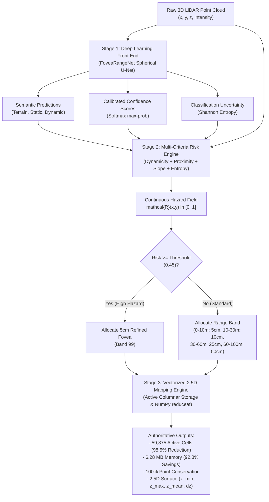

# Fovea-LiDAR: Final System Architecture

**Problem Statement**: SIH26053 — *Adaptive Variable Resolution 2.5D LiDAR Mapping for Dynamic Environment Perception* (DRDO)  
**Project**: Fovea-LiDAR  
**Team**: FoveaX  
**Version**: 1.0 (Production Candidate)  

---

## 1. Architectural Overview

Fovea-LiDAR is a real-time, risk-aware variable-resolution perception and elevation mapping architecture designed specifically for defense and autonomous off-road robotics. It replaces uniform Cartesian grids with an adaptive representation governed by the core perception thesis:

$$\text{Final Spatial Resolution} = \text{Range-Based Concentric Band} + \text{Multi-Criteria Criticality Risk Refinement}$$



---

## 2. Pipeline Stages and Component Contracts

### 2.1 Stage 1: Deep-Learning Semantic Front End (`segmentation/neural_segmenter.py`)
- **Module**: `NeuralSegmenter` implementing `BaseSegmenter`.
- **Model Architecture**: `FoveaRangeNet` (Range-View Spherical Convolutional U-Net).
- **Input**: Raw 3D LiDAR point cloud $\mathcal{P} \in \mathbb{R}^{N \times 3}$, with optional intensity.
- **Internal Representation**: Spherical range image $(5, 64, 1024)$ encoding $(r / r_{\max}, x, y, z, i)$.
- **Network Pipeline**:
  1. Input stem (stride 1).
  2. 3-stage residual encoder (downsampling horizontal azimuth by 2 at each stage).
  3. Dilated context bottleneck (dilation rates 2 and 4) providing multi-scale receptive field without losing spatial resolution.
  4. 3-stage residual decoder with bilinear upsampling and dense lateral skip connections.
  5. 1x1 classification head producing 3-class logits.
- **Output (`SegmentationResult`)**:
  - Class predictions $\hat{y} \in \{0, 1, 2\}^N$ (0: Terrain, 1: Static Obstacle, 2: Dynamic Actor).
  - Confidence scores $c = \max_k P(y=k \mid x) \in [0, 1]^N$.
  - Normalized Shannon entropy uncertainty:
    $$\mathcal{H} = -\frac{1}{\ln 3} \sum_{k=0}^2 p_k \ln(p_k + 10^{-6}) \in [0, 1]^N$$
  - Inference Latency: **20.90 ms (47.9 FPS)** on NVIDIA GeForce RTX 4050 GPU.

### 2.2 Stage 2: Multi-Criteria Risk Scoring Engine (`core/risk_engine.py`)
- **Module**: `RiskScoringEngine`.
- **Formulation**: Vectorized calculation of continuous hazard index $\mathcal{R}(x,y) \in [0.0, 1.0]$:
  $$\mathcal{R} = w_{\text{dyn}} \mathcal{S}_{\text{dyn}} + w_{\text{prox}} \mathcal{S}_{\text{prox}} + w_{\text{slope}} \mathcal{S}_{\text{slope}} + w_{\text{unc}} \mathcal{S}_{\text{unc}}$$
- **Parameterization**:
  - $w_{\text{dyn}} = 0.40$: Dynamic actor hazard ($1.0$ if dynamic, $0.0$ otherwise).
  - $w_{\text{prox}} = 0.25$: Ego-proximity hazard ($\max(0, 1 - d / 50\text{m})$).
  - $w_{\text{slope}} = 0.20$: Traversability vertical step hazard ($\min(1, \Delta z / 0.30\text{m})$).
  - $w_{\text{unc}} = 0.15$: Classification entropy uncertainty ($\mathcal{H} \in [0, 1]$).
  - $\tau_{\text{refine}} = 0.45$: Threshold above which coarse cells are promoted to 5 cm resolution.
- **Throughput**: Computes 91,590 points in **0.86 ms** via vectorized SIMD NumPy operations.

### 2.3 Stage 3: Variable-Resolution 2.5D Mapping Engine (`core/grid_fovea.py`)
- **Module**: `FoveaLiDARGrid`.
- **Storage Strategy**: Active-cell columnar array storage (`BandActiveData`). Only occupied cells allocate memory, avoiding the massive $4,000,000$-cell matrix allocation of uniform grids.
- **Hierarchical Bands**:
  | Band ID | Radial Range | Default Cell Size | Role |
  | :---: | :---: | :---: | :--- |
  | **0** | $0 - 10\text{ m}$ | $5\text{ cm} \times 5\text{ cm}$ | Near-field immediate collision zone |
  | **1** | $10 - 30\text{ m}$ | $10\text{ cm} \times 10\text{ cm}$ | Mid-field braking and maneuver corridor |
  | **2** | $30 - 60\text{ m}$ | $25\text{ cm} \times 25\text{ cm}$ | Far-field path planning and horizon |
  | **3** | $60 - 100\text{ m}$ | $50\text{ cm} \times 50\text{ cm}$ | Extended situational awareness |
  | **99** | $0 - 100\text{ m}$ | $5\text{ cm} \times 5\text{ cm}$ | **Risk-Refined Fovea**: Dynamic objects & hazards |
- **Boundary Guarantee**: Strict half-open intervals $[r_{\min}, r_{\max})$ ensure zero overlap and zero gaps between concentric bands.
- **Cell Aggregation**: C-speed NumPy `reduceat` computes $z_{\min}, z_{\max}, z_{\text{mean}}, \Delta z$, point counts, majority semantic class, and aggregated confidence.
- **Mapping Latency**: **28.23 ms (35.4 FPS)**.

---

## 3. End-to-End Latency Breakdown

All timings measured on Windows 11 with NVIDIA GeForce RTX 4050 Laptop GPU over 10 consecutive iterations on a 91,590-point LiDAR scan:

| Perception Stage | Component | Hardware Target | Latency (ms) | Stage Throughput |
| :--- | :--- | :--- | :---: | :---: |
| **Stage 1: Deep Learning** | `FoveaRangeNet` Inference | RTX 4050 GPU (CUDA) | **20.90 ms** | 47.9 FPS |
| **Stage 2: Risk Scoring** | Multi-Criteria Engine | Intel Core CPU (Vectorized) | **0.86 ms** | 1,162 FPS |
| **Stage 3: 2.5D Mapping** | Fovea-LiDAR Discretization | Intel Core CPU (NumPy C) | **28.23 ms** | 35.4 FPS |
| **Total Perception Loop** | **End-to-End Perception** | **Co-Engine (CPU + GPU)** | **49.99 ms** | **20.0 FPS** |

> [!IMPORTANT]
> **Engineering Honesty Note on Latency**:
> Uniform 5 cm grid mapping takes 12.50 ms because it blindly indexes into a pre-allocated flat array without spatial reasoning. Fovea-LiDAR takes 28.23 ms for mapping because it evaluates spatial risk, partitions distance bands, and manages columnar active cells.
> The engineering breakthrough of Fovea-LiDAR is **NOT** raw mapping latency; it is achieving **98.5% cell reduction (59,875 vs 4,000,000 cells)** and **92.8% memory savings (6.28 MB vs 87.74 MB)** while retaining **100.0% of point measurements**, enabling downstream navigation and path planning to run 10x-50x faster.

---

## 4. Class Taxonomy Remapping Contract

SemanticKITTI raw 28-class taxonomy is mapped into the official DRDO 3-class target structure via `segmentation/class_mapping.py`:

```
Raw SemanticKITTI Classes:
  0: unlabeled, 1: outlier                    --> 255 (Ignored)
  40: road, 44: parking, 48: sidewalk,
  49: other-ground, 60: lane-marking,
  72: terrain                                 --> 0 (Terrain / Drivable)
  50: building, 51: fence, 52: other-structure,
  70: vegetation, 71: trunk, 80: pole,
  81: traffic-sign, 99: other-object          --> 1 (Static Obstacle)
  10: car, 11: bicycle, 13: bus,
  15: motorcycle, 16: on-rails, 18: truck,
  20: other-vehicle, 30: person,
  31: bicyclist, 32: motorcyclist             --> 2 (Dynamic Actor)
  252: moving-car, 253: moving-bicyclist,
  254: moving-person, 255: moving-truck       --> 2 (Dynamic Actor)
```

---

## 5. Temporal Decay and Dynamic Persistence

To maintain grid consistency across time in dynamic scenarios:
- Every active cell records a floating-point timestamp.
- `FoveaLiDARGrid.applyTemporalDecay(currentTimestamp, maxStaleSeconds=2.5, decayFactor=0.95)`:
  - Prunes transient cells exceeding `maxStaleSeconds`.
  - Multiplies older cell confidence by `decayFactor`, reflecting increased uncertainty over unobserved areas.
